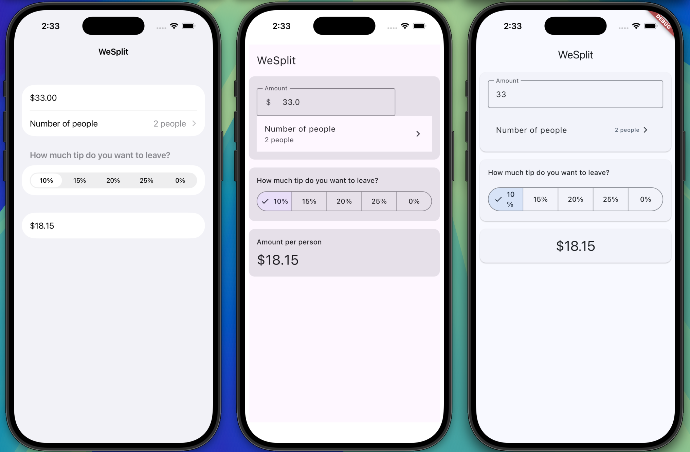

# WeSplit - SwiftUI

A bill-splitting calculator built with native SwiftUI to demonstrate modern iOS development patterns.

## Overview

WeSplit calculates how to split a restaurant bill between multiple people, including tip. This implementation showcases SwiftUI's declarative syntax, state management with property wrappers, and automatic localization.

**Part of a cross-platform comparison project** - the same app implemented in SwiftUI, Kotlin Multiplatform, and Flutter.

## Tech Stack

- **SwiftUI** - Declarative UI framework
- **Swift 5.9+**
- **iOS 17.0+**

## Features

- ✅ Currency input with automatic locale formatting
- ✅ Dynamic person count selection (2-99)
- ✅ Tip percentage picker (0%, 10%, 15%, 20%, 25%)
- ✅ Real-time calculation
- ✅ Keyboard management with done button
- ✅ Native iOS navigation

## Getting Started

### Requirements
- macOS 14+ (Sonoma)
- Xcode 15+
- iOS 17+ device or simulator

### Installation

```bash
git clone https://github.com/[your-username]/wesplit-swiftui.git
cd wesplit-swiftui
open WeSplit.xcodeproj
```

Build and run using `Cmd + R`

## Project Structure

```
WeSplit/
├── WeSplit/
│   ├── ContentView.swift      # Main UI and logic (75 lines)
│   └── WeSplitApp.swift        # App entry point
└── WeSplit.xcodeproj
```

## Implementation Highlights

- **Single-file architecture** - Entire app in 75 lines of code
- **Computed properties** - Automatic recalculation of totals
- **Property wrappers** - `@State` and `@FocusState` for reactive UI
- **Native components** - Form, Picker, TextField with zero boilerplate

## Read More

📝 **[Building the Same App in SwiftUI, Kotlin Multiplatform, and Flutter](link-to-medium-article)**

A detailed comparison of implementing WeSplit across three frameworks, examining code metrics, architecture patterns, and developer experience.

## Related Projects

- [WeSplit - Kotlin Multiplatform](https://github.com/simonbogutzky/wesplit-kmp) - 281 lines
- [WeSplit - Flutter](https://github.com/simonbogutzky/wesplit-flutter) - 238 lines

## Screenshots



## License

MIT License - see [LICENSE](LICENSE) file for details

## Author

**Simon Bogutzky**  
- Medium: [@simonbogutzky](https://medium.com/@simonbogutzky)
- Senior iOS Engineer @ Open Reply Germany
